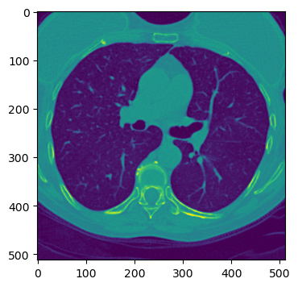
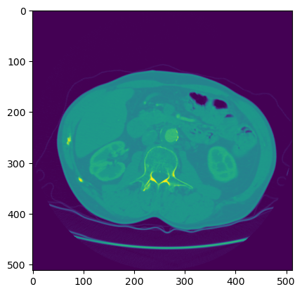

# LUNA16_DeepLearning
Deep Learning research project for CMM Mines Paris.

### Detection of cancer nodules in lungs.
Data is publicly available in the LIDC/IDRI database, found on https://luna16.grand-challenge.org/Data/

In total, 888 CT scans are included. The LIDC/IDRI database also contains annotations which were collected during a two-phase annotation process using 4 experienced radiologists. Each radiologist marked lesions they identified as non-nodule, nodule < 3 mm, and nodules >= 3 mm. See this publication for the details of the annotation process. The reference standard of our challenge consists of all nodules >= 3 mm accepted by at least 3 out of 4 radiologists. Annotations that are not included in the reference standard (non-nodules, nodules < 3 mm, and nodules annotated by only 1 or 2 radiologists) are referred as irrelevant findings. The list of irrelevant findings is provided inside the evaluation script (annotations_excluded.csv).

